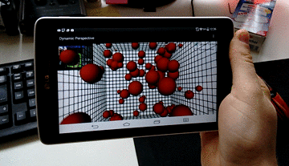

Dynamic perspective on Android
==============================

###### Project for my Master's thesis on the topic "Tablet-based 3D interaction".
Manipulate 3D objects with input data from sensors and the device camera.

### Prerequisites

* OpenCV 2.4.10 : Add OpenCV via this method (http://bit.ly/1crx0Mh) or use the version provided in this repository. With this setup you will have to install the OpenCV Manager from the Google Play store. The application will forward you to the install.

### What is this about?

This project realizes the integration of OpenCV into an Rajawali 3D application. The main purpose is to track the users face via front camera and use this information to control the virtual camera.
Additionally the users head is tracked with OpenCV for Android, to e.g. change the point of view by simply moving your head or the device.
The Rajawali (OpenGL ES 2.0/3.0) engine takes care of the rendering.

### TODOs

* Implement off-axis-perspective as shown in (http://bit.ly/1LtD1pH, http://bit.ly/1OvQRdy)
* Switch predefined scenes
* Add and remove objects from a catalogue.